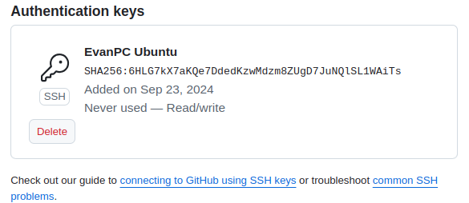

# Wishful Giving

A menudo, al querer hacerle un regalo a alguien, nos encontramos con la dificultad de no saber qué le gustaría recibir. Es posible que la persona ya tenga todo lo que necesita, o que sus gustos sean muy especificos.  Esto puede generar indecisión, compras poco acertadas o incluso la necesidad de recurrir a regalos genéricos poco personales. 

## ¿Cómo?

Para solucionar este problema, se propone desarrollar una aplicación que permita a los usuarios crear listas de deseos personalizadas, en la que se incluya:

* **Experiencias:**
  * Se podrán añadir viajes, conciertos, actividades, etc.

* **Objetos físicos:**
  * Ropa, libros, tecnologías, etc.

* **Deseos no materiales:**
  * Tiempo de calidad, ayuda con alguna tarea, etc.

La aplicación permitirá a los usuarios priorizar sus deseos y proporcionar detalles adicionales como enlaces de compra, tallas, colores preferidos, etc.
Además, se incorporará un sistema de presupuesto colaborativo. Esto significa que un grupo de personas podrá unirse para hacerle un regalo a un usuario en particular, definiendo un presupuesto total y visualizando qué deseos se ajustan al mismo.

## Lógica de negocio

La lógica de negocio de la aplicación se centrará en:

* **Gestión de usuarios:** Resgistro, inicio de sesión y perfiles de usuario.
* **Creación y gestión de listas de deseos:** Añadir, editar eliminar y priorizar deseos.
* **Sistema de presupuesto colaborativo:** Definición de presupuesto grupal, visualización de deseos acordes al presupuesto
* **Sistema de sugerencias:** Algoritmo que sugiera ideas de regalos basándose en los deseos de la lista, el presupuesto disponible y las preferencias del usuario.

## Beneficios para el usuario:

* Los usuarios que crean la lista de deseos tienen la seguridad de recibir regalos que realmente desean y necesitan
* Los usuarios que regalen evitan la incertidumbre y la posibilidad de hacer un regalo no deseado.
* Se fomenta la colaboración y se facilita la organización de regalos grupales

## Configuración

Claves privadas y públicas enlazadas con GitHub

