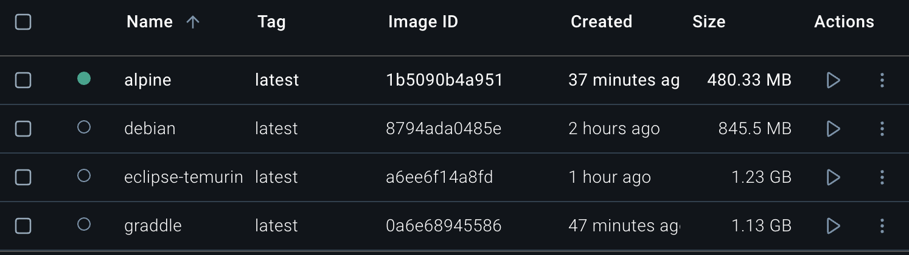

# Imagen de Docker
## Criterios de elección

- Se valorará que la imagen reciba actualizaciones frecuentes (parches de seguridad) y tenga un soporte activo. Lo mediremos buscando la última actualización en Docker Hub y/o repositorio oficial.

- Se priorizan imágenes más pequeñas, lo que reduce tiempos de descarga y despliegue en CI/CD. Lo mediremos comparando los tamaños resultados de `docker images` en el entorno de desarrollo.

- Se valorará que la imagen tenga insignias de ¨Official¨ o ¨Verified Publisher¨ ya que aporta confianza en la calidad y seguridad de la imagen y no estamos usando ¨cualquier cosa¨.

## Opciones a evaluar

- [Gradle Oficial](https://hub.docker.com/_/gradle)  tiene su última actualización reciente (hace 9 horas) ya Gradle oficial suele publicar imágenes junto con cada release. Recibe parches de seguridad relacionados con la base (Alpine/Debian) y Gradle. Su tamaño tras la construcción ha sido de 1.13 GB. La imagen de Gradle en Docker Hub tiene las insignias de *Official* . 

- [Eclipse Temurin (Java 17) + Inatalacion manual de Gradle](https://hub.docker.com/_/eclipse-temurin) se actualiza con alta frecuencia (ultima hace 1 día) debido a los parches de seguridad de OpenJDK. El mantenimiento es sólido, contando con versiones LTS. Al instalar Gradle manualmente, el tamaño creció hasta 1.23 GB. La imagen de Eclipse Temurin en Docker Hub posee la insignia de *Official*, si bien la capa adicional donde se instale Gradle no dispondrá de ninguna insignia específica.

- [Ubuntu/Debian Slim + Java 17 + Gradle manual](https://hub.docker.com/_/debian) en su variante Slim, al ser oficial, suele publicar sus imágenes con regularidad y recibir actualizaciones de seguridad con frecuencia (ultima hace 9 días). El tamaño final tras la instalación de Java 17 y Gradle es de 845 MB. Aunque conlleva mayor trabajo de configuración manual, esta opción permite un control más fino sobre las versiones de Java y Gradle, y puede competir en ligereza con otros enfoques si se optimizan las instalaciones.

- [Alpine + Java 17 + Gradle manual](https://hub.docker.com/_/alpine) también es una imagen oficial que se caracteriza por su muy reducido tamaño base, generalmente por debajo de los 10 MB en la versión mínima. Al añadir Java 17 y Gradle, la imagen final creció hasta los 480 MB, siendo la opción más liviana. Cuenta con la insignia de *Official* y su última actualización fue hace 16 días.

### Tamaño de la imagen
Observamos los tamaños de las imagenes tras hacer la configuración necesaria para instalar Java y Gradle en cada una de las imágenes:

## Elección final

Tras comparar las opciones disponibles, se observa un empate en lo referente a las insignias de confianza y la frecuencia de mantenimiento, ya que todas cuentan con actualizaciones recientes y poseen algún grado de respaldo oficial. Sin embargo, el criterio determinante para la elección ha sido el tamaño de la imagen final, que en el caso de Alpine se ha medido en aproximadamente 480 MB después de agregar Java 17 y los pasos requeridos para Gradle 8.12. Esta cifra se sitúa por debajo de la mayoría de alternativas estudiadas, lo que inclina la balanza a favor de Alpine